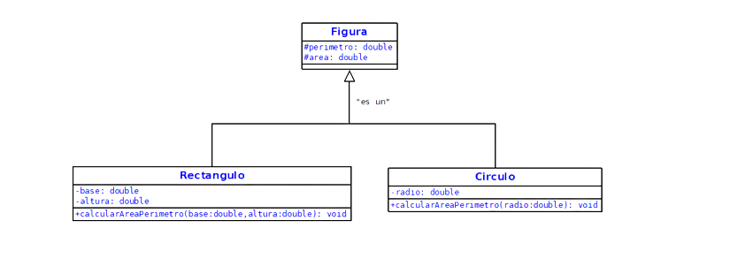

Con base en el siguiente diagrama de clases y utilizando del mecanismo de herencia, implementar programa en java para calcular el área y el perímetro de un rectángulo y un circulo.



# Diagrama


# APP

```java
public class Test {
    public static void main(String[] args) {
        //---Figuras---
        //Rectangulo
        double base = Double.parseDouble(JOptionPane.showInputDialog("Ingrese el valor de la base: " ));
        double altura = Double.parseDouble(JOptionPane.showInputDialog("Ingrese el valor de la altura: " ));
        Rectangulo rectangulo = new Rectangulo(base, altura);
        rectangulo.calcularAreaPerimetro();
        JOptionPane.showMessageDialog(null, "El area del rectangulo es: " + rectangulo.getArea());
        JOptionPane.showMessageDialog(null, "El area del rectangulo es: " + rectangulo.getPerimetro());

        //Circulo
        double radio = Double.parseDouble(JOptionPane.showInputDialog("Ingrese el valor de la base: " ));
        Circulo circulo = new Circulo(radio);
        circulo.calcularAreaPerimetro();
        JOptionPane.showMessageDialog(null, "El area del circulo es: " + circulo.getArea());
        JOptionPane.showMessageDialog(null, "El perimetro del circulo es: " + circulo.getPerimetro());
    }
}
```